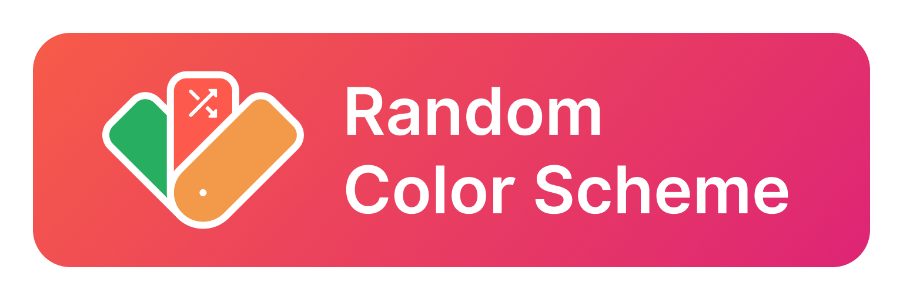

# Random Color Scheme

Making a coherent Material Design theme is hard. This is a Flutter plugin that generates a random color pallet based on Material Design while respecting WCAG guidelines.

The idea is for you to (temporarily) replace your `ColorScheme()` with a `randomColorSchemeLight()` or `randomColorSchemeDark()`.
On each run, hot refresh or hot restart, the app is going to look different. The theme is printed in terminal, so you can easily copy and paste back into your project with the colors that you want to stay.

The interactive sample allows you to see how it works and the reasoning behind:

<a href="https://bernaferrari.github.io/RandomColorScheme"></a>

[](https://bernaferrari.github.io/RandomColorScheme/)

## Usage

In the `pubspec.yaml` of your flutter project, add the following dependency:

[](https://pub.dev/packages/random_color_scheme)

```yaml
dependencies:
  random_color_scheme: ^VERSION
```

In your project, just replace the `ColorScheme.dark(...)` with `RandomColorSchemeDark()`.
If you want a light theme, there is a `RandomColorSchemeLight()`.

```dart
import 'package:random_colorscheme/random_color_scheme.dart';

Theme(
  data: ThemeData(
    colorScheme: randomColorSchemeDark(),
  ),
  child: MyApp(),
)
```
#### How it works
This started in my [Color Studio project](https://github.com/bernaferrari/color-studio).
I started looking at the Material Design Guidelines on color for both light and dark theme.
After extracting some colors (like the Primary, Secondary and Owl Study), I decided to see how similar were they, in what range are they and how they behave together.
Then, I used [HSLuv](https://www.hsluv.org/) with a random number generator and rules detected from my observation. The final adjustments were made when tweaking the sample.
HSLuv is great because only the Lightness attribute affects WCAG calculated contrast, so all themes are guaranteed to pass
a minimum accessibility threshold.

#### Function listing
- `randomColorSchemeDark(seed: null | int)`
- `randomColorSchemeLight(seed: null | int)`
- `randomColorScheme(seed: null | int, isDark: bool)`

Seed: an integer which guarantees the random function is always going to have the same output (i.e., the same ColorScheme).
It is optional.

## Reporting Issues

If you have any suggestions or feedback, issues and pull requests are welcome.
You can report [here](https://github.com/bernaferrari/RandomColorScheme/issues).

## License

    Copyright 2020 Bernardo Ferrari

    Permission is hereby granted, free of charge, to any person obtaining a copy of this software and associated documentation files (the "Software"), to deal in the Software without restriction, including without limitation the rights to use, copy, modify, merge, publish, distribute, sublicense, and/or sell copies of the Software, and to permit persons to whom the Software is furnished to do so, subject to the following conditions:

    The above copyright notice and this permission notice shall be included in all copies or substantial portions of the Software.

    THE SOFTWARE IS PROVIDED "AS IS", WITHOUT WARRANTY OF ANY KIND, EXPRESS OR IMPLIED, INCLUDING BUT NOT LIMITED TO THE WARRANTIES OF MERCHANTABILITY, FITNESS FOR A PARTICULAR PURPOSE AND NONINFRINGEMENT. IN NO EVENT SHALL THE AUTHORS OR COPYRIGHT HOLDERS BE LIABLE FOR ANY CLAIM, DAMAGES OR OTHER LIABILITY, WHETHER IN AN ACTION OF CONTRACT, TORT OR OTHERWISE, ARISING FROM, OUT OF OR IN CONNECTION WITH THE SOFTWARE OR THE USE OR OTHER DEALINGS IN THE SOFTWARE.